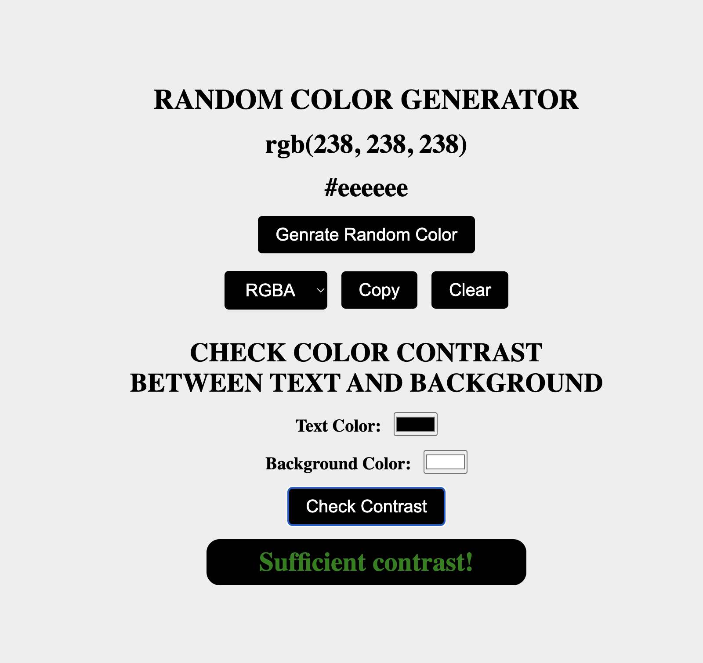

# Color Matcher

## Description:
The Color Matcher project is a web application designed to help users generate random colors and test their compatibility with text and background colors. The application is developed using HTML, CSS, and JavaScript.

## Features:
1. Random Color Generator: Users can generate random colors by clicking a button.
2. Copy Color: Users can easily copy the hex or rgba code of the generated color.
3. Color Compatibility Test: Users can input their desired text and background colors, and the application will check if the combination is suitable for readability.
4. Instant Testing: By clicking a button, users can instantly test their chosen text and background colors to see if they provide good contrast and readability.

## Technologies Used:
1. HTML: For structuring the web page.
2. CSS: For styling the elements and making the interface visually appealing.
3. JavaScript: For implementing the functionality of generating random colors, copying colors, and testing color compatibility.

Overall, the Color Matcher project aims to provide a simple yet useful tool for web designers and developers to experiment with colors and ensure optimal readability for their content.